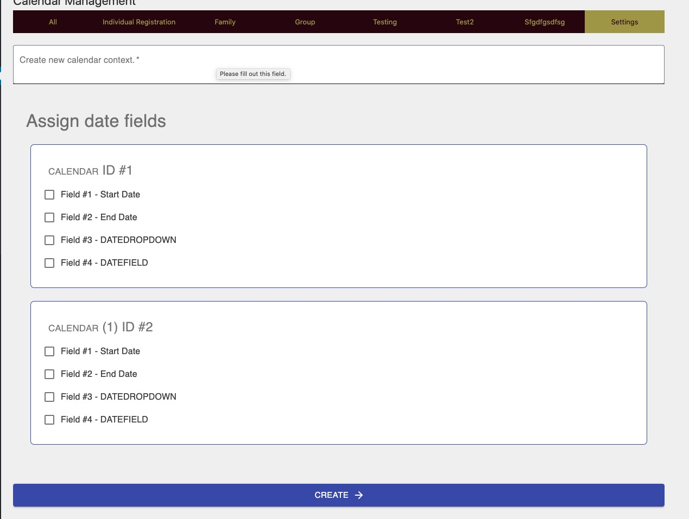
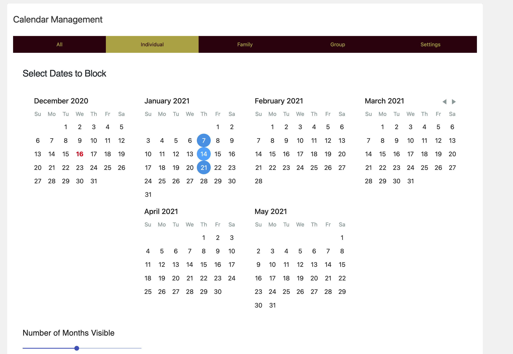
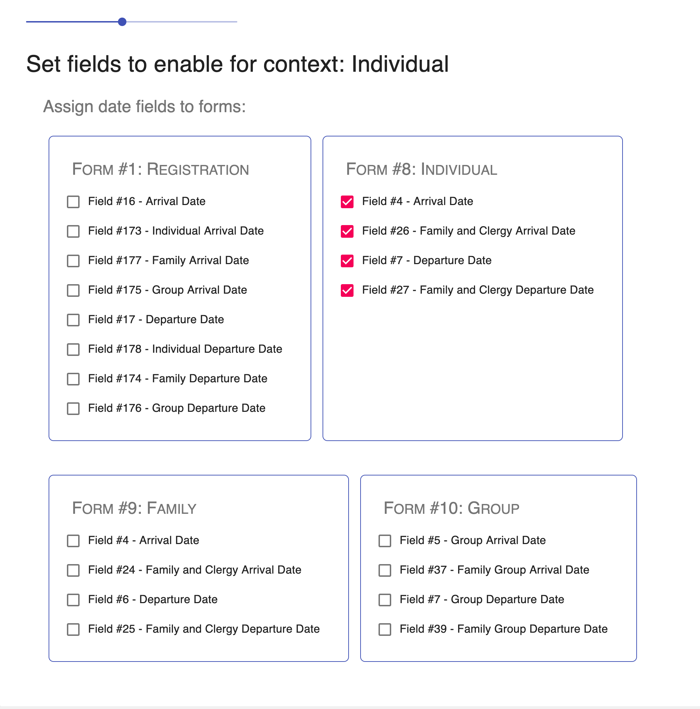
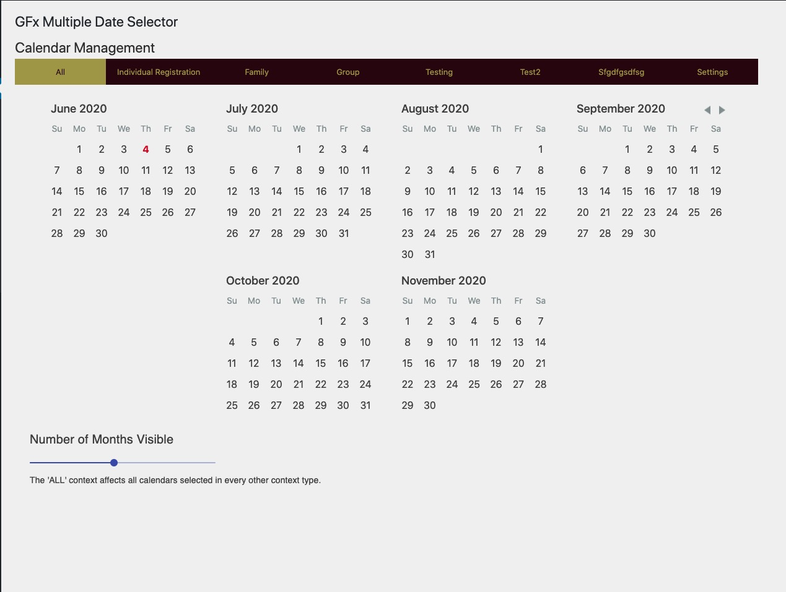

# GFx Multiple Date Picker

An easier way to manage and limit dates on WordPress Gravity Forms. This plugin enables you to select dates to block for
multiple calendars at once with a simple view.

---

## Requirements

Needs Gravity Forms and Gravity Perks, along with the Gravity Perks limit dates perk.

## Installation

Like any WordPress plugin, download zip and upload, or git clone into

## Set up

First, just go to the plugin settings under the Gravity Forms tab in the WordPress dashboard.

Clarification on 'all', every form field selected in other contexts will show up under all. So for every field selected
in every other context, this field will be blocked in 'all' settings. Hope that makes sense.

## Features

- Create multiple contexts for calendars to manage, selecting which date fields belong in which.

- Assign each context dates to block, selecting individual date fields from all forms available. Slider lets you choose
  how many months are visible at a time.

- Select the date fields to block on each context from the various form fields defined from Gravity Forms.

- Block every other context type at once with the 'ALL' context

## Permissions

On initialization, creates a new role, `edit_gfx_calendar` to allow only administrators to access and edit the
limitations.

## To Do

1. Unit testing -
    1. https://macarthur.me/posts/simpler-unit-testing-for-wordpress
2. Create a readme text file, with similar content. Follow WordPress guidelines.
3. Splitting code chunks, hashing, etc., for performance, loading by the generated manifest.
4. More comments on code for clarity, perhaps migrate to TypeScript for strict type checking.
5. Perhaps handle calendar naming differently, to ease naming restrictions for calendar contexts.
6. Allow customization of limitation mode, i.e. block or allow dates
7. Use intermediary client state for selection of dates/choices of fields, thereby not bind UI to server state, less
   perceived loading.
    1. Put the loading indicator on a corner instead of as overlay.
    2. Debounce server updates, less bandwidth on user.
8. More documentation and screenshots in readme.txt
9. Deploy to WordPress Plugins
10. Make sure that Gravity Perks Limit Date Extension is enabled!

## Development

1. Watch for changes - `npm run watch`
2. Lint: `npm run lint`
3. Production bundle built with `npm run build` command
